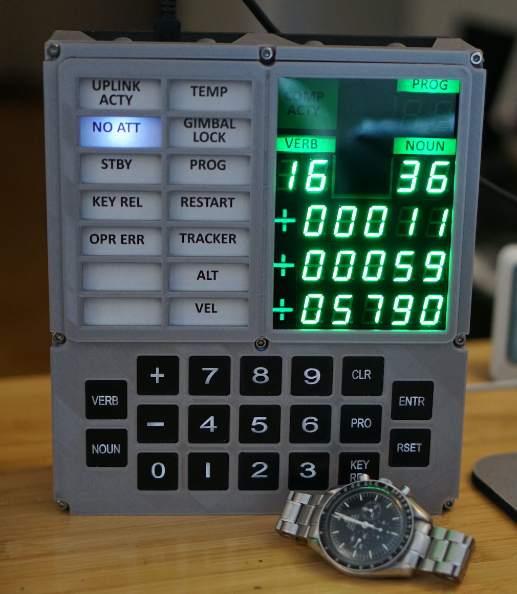

# KennysOpenDSKY
Kenny's Open DSKY Software

## Description
This project contains C/C++ source code for the Arduino nano which
will control the Open DSKY kickstarter kit.

This project also contains source code for Linux/Windows/Macos which
runs as `ncurses` text-based simulator of the arduino software. This
will be referred to as the **curses simulator**.

The **curses simulator** allows for testing and deugging the complete software
without having to upload to the Arduino nano.



## Acknowledgments
This is an original implementation of code needed to drive the
Open DSKY hardware. However, I derived many routines from these sources:

+ **S&T Geotronics** James Sanderson and Marc Tessier for creating the
	Open DSKY kit. <http://www.stgeotronics.com>

+ **Scott Pavlovec** github project. <https://github.com/scottpav>. This
	contained the reference implementation which I used to talk to the hardware.

+ The functionality offered was inspired by the functionality offered by
		the **Apollo 50th Anniversary** project which came pre-installed with the Open DSKY kit.
	(Apollo Education Experience Program, Cumming Georgia).
	Thanks **Bill Walker** for an incredible software and user manual.
	Website 1: <http://apolloexperience.com>.
	Website 2: <https://www.gofundme.com/apollo-education-experience-project>

+ The audio clips provided here are taken from the **Apollo 50th Anniversary** project SD card.

+ The following website has information about the virtual apollo guidance
	computer: <http://www.ibiblio.org/apollo/>.

+ An online apollo DSKY emulator <https://svtsim.com/moonjs/agc.html>. I used this great tool to
	tweak my code to better reflect how an actual Apollo DSKY worked.

## Features
+ A virtual machine and byte code interpreter
+ Two threads of control: One thread is a backround task, which
	runs major modes. The other thread is a foreground task which runs simple verbs/nouns.
+ Ability to enter values using the keypad instead of +/- keys.

## Files
The main source code is in `KennysOpenDSKY.cpp`. 

+ `KennysOpenDSKY.cpp` - the main source code file C/C++.
+ `kennysagc.asm` - the assembly code for the verb/noun/prog programs.
+ `kennysagc.h` - the assembled code. produced by running `assembler.py`.
+ `KennysOpenDSKY.ino` - an empty file to satisfy the Arduino CLI sketch requirements.
+ `KennysOpenDSKY.dump` - a dump of the AVR nano assembly code for the Arduino version
+ `assembler.py` - Python 3 program which assembles the assembly code into a C header file.
+ `Makefile` - A simple makefile to compile on Linux and also compile/upload the
		sketch using the Arduino CLI tools.
+ `dsky` - The **curses simulator** executable produced on linux
+ `dsky_debug` - The **curses simulator** executable produced on linux with debugging symbols (-g).
+ `log.txt` - a log file for debugging when running the **curses simulator**.
+ `persist.txt` - emulates the EEPROM and RTC RAM area when using the **curses simulator**.
+ `audio` - directory containing the SD card audio files for the MP3 player.
+ `images` - directory containing images used for documentation purposes. Also contains a
	`pdf` and `pages` document for use with the **Green Plexi-glass** modification.


## Memory Usage
The current build uses the following memory on the Arduino:

```text
$ make sketch
arduino-cli compile -e --fqbn arduino:avr:nano KennysOpenDSKY
Sketch uses 22292 bytes (72%) of program storage space. Maximum is 30720 bytes.
Global variables use 1288 bytes (62%) of dynamic memory, leaving 760 bytes for local variables.
Maximum is 2048 bytes.

Used library      Version Path                                                                          
Adafruit NeoPixel 1.12.0  /M/kjs/ARDUINO/Arduino/libraries/Adafruit_NeoPixel                            
LedControl        1.0.6   /M/kjs/ARDUINO/Arduino/libraries/LedControl                                   
TinyGPSPlus       1.0.3   /M/kjs/ARDUINO/Arduino/libraries/TinyGPSPlus                                  
Wire              1.0     /M/kjs/ARDUINO/.arduino15/packages/arduino/hardware/avr/1.8.6/libraries/Wire  
EEPROM            2.0     /M/kjs/ARDUINO/.arduino15/packages/arduino/hardware/avr/1.8.6/libraries/EEPROM

Used platform Version Path                                                         
arduino:avr   1.8.6   /M/kjs/ARDUINO/.arduino15/packages/arduino/hardware/avr/1.8.6
```

## Dependencies
### Arduino
This section describes the third party libraries needed to compile
the sketch for Arduino.

+ **Wire** - standard arduino library. I2C communications.
+ **EEPROM** - standard arduino library for reading/writing the 2K eeprom memory.
+ **Adafruit NeoPixel** - library used to illuminate the neo pixels.
+ **LedControl** - library used to talk to 7-segment LEDs.
+ **TinyGPS++** - library to read the GPS device and parse its output.
+ **Arduino CLI tools for linux** - I don't use the Arduino IDE. I use `arduino-cli` tool.
+ **python3** - this is needed to run `assembler.py`. The assembler is a simple text only
		python program which should with most python installations.

### Linux
This section describes the notable libraries needed to compile
the curses simulator on linux/macos/windows.

+ **ncurses** - this is a library for drawing simple text based user interfaces. It
		is widely available, and comes installed by default on most linux distros.

+ **sigaction()** - this is capability of most unixes. It is included on all linux operating
			systems. Special porting may be needed for Windows or Macos. It is used to
			implement the 100ms timer.

+ **getrandom()** - this is a library function provdided by linux. It is used to provide
			random numbers to the code for blinking the **Uplink Acty**
			and **Comp Acty** lights. As well as the random number assembly instruction.

+ **python3** - this is needed to run `assembler.py`. The assembler is a simple text only
		python program which should work on most python installations.


## Compiling for Arduino Nano
I use the Arduino Command Line Interface. I run this under linux on a Raspberry Pi.
The included ```Makefile``` shows the commands needed to compile the sketch and
upload to your Open DSKY kit.

To assemble the assmbly code use:
```
	$ ./assembler.py kennysagc.asm
```
This will produce a file called `kennysagc.h` which is included by `KennysOpenDSKY.cpp`.

To compile the sketch use:
```
	$ arduino-cli compile -e --fqbn arduino:avr:nano KennysOpenDSKY
```

To upload the sketch use:
```
	$ arduino-cli upload -p /dev/ttyUSB0 --fqbn arduino:avr:uno KennysOpenDSKY
```
Replace **/dev/ttyUSB0** with whatever is required on your system.

The provided simple `Makefile` encapsulates these commands. This builds the sketch:
```
	$ make sketch
```

This uploads the sketch to your Arduino Nano:
```
	$ make upload
```


## Compiling for Linux
To compile on linux `gcc` is used. The program itself is written in simple C/C++.
(Does not use any fancy features of C++ beyond `class`).

To assemble the assembly code use:
```
	$ ./assembler.py kennysagc.asm
```
This produces a file caled `kennysagc.h` which is included by `KennysOpenDSKY.cpp`.

This builds the `dsky` executable:
```
	$ gcc -DCURSES_SIMULATOR -lncurses KennysOpenDSKY.cpp -o dsky
```

This builds the `dsky_debug` executable (containing debug symbols):
```
	$ gcc -DCURSES_SIMULATOR -DDSKY_DEBUG -g -lncurses KennysOpenDSKY.cpp -o dsky_debug
```

The provided simple Makefile builds both executables with this command:
```
	$ make
```

### Running the Curses Sumulator
To run the executable simply run it as follows (no command line arguments are needed):
```
	$ ./dsky
```

or,

```
	$ ./dsky_debug
```

or (when debugging),
```
	$ gdb ./dsky_debug
```

## Compiling for Windows/Macos
I don't know how to compile for these platforms. Make sure
you have the ```ncurses``` library available. Make sure you have sigaction() available.
Make sure you have getrandom(). The compiliation should be pretty straight forward.

## Using the Assembler
The program ``assembler.py`` is a simple one pass assembler written in python.
You will need python3 to recompile the assembly. This github repository
however contains a pre-compiled version of the assembly.

## Assembly Language
This section documents all the assembly instructions.

## Running the Curses Simulator
The **curses simulator** is a text based 'ncurses' application. You run
the program from any text terminal and you will see a simple text screen
that represents the DSKY display and DSKY keyboard.

Run with this command,
```
	$ ./dsky
```


### Keys
The keys map to you keyboard thusly. Only lower case keys are accepted.
+ '0' ... '9' - Digits
+ '+'	- Plus
+ '-'	- Minus
+ 'v'	- VERB
+ 'n'	- NOUN
+ 'p'	- PRO (Proceed)
+ 'c'	- CLR (Clear)
+ 'k'	- KEY REL (Key Release)
+ 'e' or 'Enter' - ENTR (Enter)
+ 'r'	- RSET (Reset)
+ 'q'	- Quit the DSKY simulator

The behavior of this program should be identical to the behavior it
will have when run on the Arduino Open DSKY hardware. The GPS and IMU
devices are simulated with *fake* data. The MP3 player only shows audio
as a text line at the bottom of the window. The audio shows how many seconds
remain in the audio clip. But no sound will play!


### log file
When running the **curses simulator** the file ```./logfile.txt``` is produced.
It is used for debugging purposes. Also contains the memory sizes of some data structures.

### persistent data
The file ```./persist.txt``` contains a simulated EEPROM storage and simulated RTC clock RAM.
This allows the **curses simulator** to retain information between runs of the program.

## DSKY Usage
This section describes the general usage of the DSKY. The interface was modeled
by my experimentation with a faithful DSKY simulator (See <https://svtsim.com/moonjs/agc.html>).

### General Notes:
+ **ENTR** not required after each verb or noun entry. Pressing **ENTR** causes
	the DSKY to take action on the currently showing verb/noun fields.

+ **KEY REL** - When the **KEY REL** light is blinking, then the KEY REL button can be
	pressed to cancel the entry of a noun/verb.

+ **OPR ERR** - When **OPR ERR** light is blinking then the user should press **RSET** to reset
	this.

+ You cannot launch a program using the **PRO** key. Instead you must enter `V37` `ENTR` and
	then type in a two digit program number which appears in the noun field. Then `ENTR` again
	to launch the program.

## VERBs, NOUNs, and PROGRAMs
This section documents the avalable VERB/NOUN combinations and the PROGRAM's.

## Green Plexi-glass Modification
This section describes my modification to the Open DSKY. I decided
I didn't like how fuzzy the LED digits were. I decided to use a green
plexi-glass window to make the LED region nicer to look at and avoid
the fuzzyness and dimness of the original kit.


I bought this product from amazon:
```
	Transparent Green Acrylic Sheet (12" x 20", 1/16" / 1.5mm)
	(MakerStock Store)
```
Make sure the thickness is 1.5mm.

I meausred the desired size and used a box cutter knife to cut the plastic.
I used a metal ruler to maintain a straight line. After 10 to 12 cuts I broke
the plastic along a straight table edge. The plastic broke cleanly along the
line I had scored with the razor.


I then used a utility knife to scrape the size to fit perfectly.


I did the same cutting operation to the provided clear plastic that came
with the Open DSKY kit.


I used duct tape to adhere my green plexi-glass sheet to the table I was working on
so that the sheet and ruler wouldn't move.

The sticker that came with the Open DSKY kit I cut in half. I retained the left hand side
of the sticker for the caution and warning lights pane. But I threw away the right hand side.

Using my laser printer I printed out `screen_stuff.pdf` and used scissors to cut out a the
black region plus verb/noun/prog text. This I carefully positioned over the verb/noun/prog
lights.

I also cut out the block of plus symbols. These I overlayed over the plus 7-segment LEDs.

I used a small piece of scotch tape to hold these overlays in place while I assembled the
display and bezel. Best results are achieved if the black ink covers anything inside that
might reflect light.

## Review of the Open DSKY Kit
This section contains my thoughts on the Open DSKY kit.

Overall I loved it. It requires a lot of detail work for final assembly.
However this is a kit and as the creators say in various YouTube videos
this is a DIY (Do It Yourself) project. The most important letter is the "Y" letter.

Final assembly required me to use a dremel grinding tool to carve out plastic
from the back in order to ensure the front cover fits snuggly onto the cicruit board.

I didn't like the "sticker" which you use to cover over the beautiful LED's, so I
customized my device.

The electronics and provided circuit board were excellend. All the parts were well labeled.
It makes for a greate arduino platform to play with many different devices: GPS, IMU, MP3 player
and Real Time Clock.

Little details included with the Kit were also very nice. There were two stickers that you
affix to the case which look like official NASA tracking signage. There was also a tiny
little 3d-printed DSKY.

### Sticker 1


### Sticker 2


### Mini-DSKY


The assembly instructions were a little sparse. But this increased my feeling of satisfaction
when I successfully built the thing. How to perform final assembly was not well documented.

Be careful with the buttons. Using wire cutters to cut off the plastic bump on all the buttons
can result in inadvertently cutting the wire lead that illuminates the button. Thankfully
they provide an extra button if you screw one of them up.

Make sure the GPS unit is flush with the circuit board when you solder it on.

All the components came in indiviual plastic and were labeled. There was a inventory sheet
showing all the components. The kit arrived in good  packaging. I definately felt the kit was worth the $600.

There are good online schematics. The sample source code is pretty gross, but also pretty easy
reverse engineer. Unfortunately there lacks a schematic showing how the MP3 player was wired up.

## Author
Ken Stauffer<BR>
New York, NY.<BR>
2/14/2024
