# KennysOpenDSKY
Kenny's Open DSKY Software

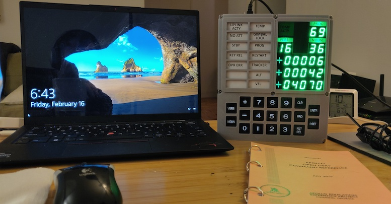

## Table Of Contents
+ [KennysOpenDSKY](#kennysopendsky)
  + [Table Of Contents](#table-of-contents)
  + [Description](#description)
  + [Acknowledgments](#acknowledgments)
  + [Features](#features)
  + [Files](#files)
  + [Memory Usage](#memory-usage)
  + [Dependencies](#dependencies)
    + [Arduino](#arduino)
    + [Linux](#linux)
  + [Compiling for Arduino Nano](#compiling-for-arduino-nano)
  + [Compiling for Linux](#compiling-for-linux)
    + [Running the Curses Sumulator](#running-the-curses-sumulator)
  + [Compiling for Windows/MacOS](#compiling-for-windowsmacos)
  + [Running the Curses Simulator](#running-the-curses-simulator)
    + [Keys](#keys)
    + [Log File](#log-file)
    + [Persistent Data](#persistent-data)
  + [DSKY Usage](#dsky-usage)
    + [General Notes:](#general-notes)
    + [VERBs, NOUNs, and PROGRAMs](#verbs-nouns-and-programs)
    + [Status](#status)
    + [Verbs](#verbs)
    + [Nouns](#nouns)
    + [Verb-Nouns](#verb-nouns)
    + [Programs](#programs)
  + [Using the Assembler](#using-the-assembler)
  + [Assembly Language](#assembly-language)
    + [Virtual Machine Architecture](#virtual-machine-architecture)
    + [Comments](#comments)
    + [Labels](#labels)
    + [Scope Brackets](#scope-brackets)
    + [Directives](#directives)
    + [Instruction Mnemonic Suffixes](#instruction-mnemonic-suffixes)
    + [Instruction Arguments](#instruction-arguments)
    + [Numeric Literals](#numeric-literals)
    + [Instructions](#instructions)
    + [Example](#example)
  + [Code Walk Through](#code-walk-through)
    + [Display Refresh](#display-refresh)
    + [Add New Instructions](#add-new-instructions)
    + [Adding a new VERB](#adding-a-new-verb)
    + [Adding a new PROGRAM](#adding-a-new-program)
  + [Green Acrylic Modification](#green-acrylic-modification)
  + [Review of the Open DSKY Kit](#review-of-the-open-dsky-kit)
    + [Sticker 1](#sticker-1)
    + [Sticker 2](#sticker-2)
    + [Mini-DSKY](#mini-dsky)
  + [Author](#author)

## Description
This project contains C/C++ source code for the Arduino nano which
will control the Open DSKY kickstarter kit.

This project also contains source code for Linux/Windows/MacOS which
runs as a `ncurses` text-based simulator of the arduino software. This
will be referred to as the **curses simulator**.

The **curses simulator** allows for testing and debugging the complete software
without having to upload to the Arduino nano.

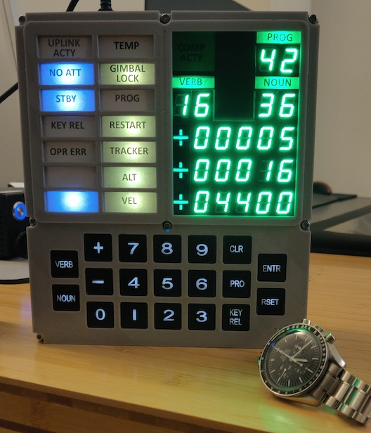

## Acknowledgments
This is an original implementation of code needed to drive the
Open DSKY hardware. However, I derived many ideas and code from these sources:

+ **S&T Geotronics** James Sanderson and Marc Tessier for creating the
    Open DSKY kit. <http://www.stgeotronics.com>

+ **Scott Pavlovec** github project. <https://github.com/scottpav/OpenDSKY>. This
    contained the reference implementation which I used to talk to the hardware.

+ The functionality offered was inspired by the functionality offered by
        the **Apollo 50th Anniversary** project which came pre-installed with the Open DSKY kit.
    (Apollo Education Experience Program, Cumming Georgia).
    Thank you **Bill Walker** for an incredible software creation and user manual.
    Website 1: <http://apolloexperience.com>.
    Website 2: <https://www.gofundme.com/apollo-education-experience-project>

+ The audio clips provided here are taken from the **Apollo 50th Anniversary** project SD card.

+ The following website has information about the virtual apollo guidance
    computer: <http://www.ibiblio.org/apollo/>.

+ An online Apollo DSKY emulator <https://svtsim.com/moonjs/agc.html>. I used this great tool to
    tweak my code to better reflect how an actual Apollo DSKY worked.

+ Keyboard debouncing logic comes from **James Sanderson's** code mentioned in this
    youtube video: <https://www.youtube.com/watch?v=zMDSz0iKxIs&t=1726s>
    This is an improvement over Scott Pavlovec's keyboard reading code.

+ **Ron Diamond** for his GPS reading code which removes the dependency on *TinyGPS++*.
	<https://github.com/rondiamond/OpenDSKY>

## Features
+ A virtual machine and byte code interpreter.
+ Two threads of control: One thread is a background task, which
    runs major modes (PROGs). The other thread is a foreground task which runs VERBs & NOUNs.
+ Ability to enter values using the keypad instead of +/- keys.
+ More accurately reproduces the Apollo DSKY interface.
+ **Curses Simulator** - test and develop your code on your computer before uploading it to the Arduino.
+ Better keyboard debounce logic.
+ Allows for easy modifications to add custom apps to the DSKY.
+ Strives to have minimal dependencies on Arduino libraries.

## Files
The main source code is in `KennysOpenDSKY.cpp` and `kennysagc.asm`.

+ `KennysOpenDSKY.cpp` - the main source code file C/C++.
+ `kennysagc.asm` - the assembly code for the verb/noun/prog programs.
+ `kennysagc.h` - the assembled code. produced by running `assembler.py`.
+ `KennysOpenDSKY.ino` - an empty file to satisfy the Arduino CLI sketch requirements.
+ `KennysOpenDSKY.dump` - a dump of the AVR nano assembly code for the Arduino version.
+ `assembler.py` - Python 3 program which assembles the assembly code into byte codes.
+ `Makefile` - A simple makefile to compile on Linux and also compile/upload the
        sketch using the Arduino CLI tools.
+ `dsky` - The **curses simulator** executable produced on Linux.
+ `dsky_debug` - The **curses simulator** executable produced on Linux with debugging symbols (-g).
+ `log.txt` - a log file for debugging when running the **curses simulator**.
+ `persist.txt` - emulates the EEPROM and RTC RAM area when using the **curses simulator**.
+ `audio` - directory containing the SD card audio files for the MP3 player.
+ `images` - directory containing images used for documentation purposes. Also contains a
    `pdf` and `pages` document for use with the [**Green Acrylic Modification**](#green-acrylic-modification).

## Memory Usage
The current build uses the following memory on the Arduino:

```text
$ make sketch
arduino-cli compile -e --fqbn arduino:avr:nano KennysOpenDSKY
Sketch uses 22612 bytes (73%) of program storage space. Maximum is 30720 bytes.
Global variables use 1115 bytes (54%) of dynamic memory, leaving 933 bytes for local variables.
Maximum is 2048 bytes.

Used library      Version Path                                                                          
Adafruit NeoPixel 1.12.0  /M/kjs/ARDUINO/Arduino/libraries/Adafruit_NeoPixel
LedControl        1.0.6   /M/kjs/ARDUINO/Arduino/libraries/LedControl
Wire              1.0     /M/kjs/ARDUINO/.arduino15/packages/arduino/hardware/avr/1.8.6/libraries/Wire
EEPROM            2.0     /M/kjs/ARDUINO/.arduino15/packages/arduino/hardware/avr/1.8.6/libraries/EEPROM

Used platform Version Path                                                         
arduino:avr   1.8.6   /M/kjs/ARDUINO/.arduino15/packages/arduino/hardware/avr/1.8.6
```

## Dependencies
### Arduino
This section describes the third party libraries and components needed to compile
the sketch for Arduino.

+ **Wire** - standard arduino library. I2C communications.
+ **EEPROM** - standard arduino library for reading/writing the 2K eeprom memory.
+ **Adafruit NeoPixel** - library used to illuminate the neo pixels.
+ **LedControl** - library used to talk to 7-segment LEDs.
+ **Arduino CLI tools for Linux** - I don't use the Arduino IDE. I use `arduino-cli` tool.
+ **python3** - this is needed to run `assembler.py`. The assembler is a simple text only
        python program which should work on most python installations.

### Linux
This section describes the notable libraries & components needed to compile
the curses simulator on Linux/MacOS/windows.

+ **ncurses** - this is a library for drawing simple text based user interfaces. It
        is widely available, and comes installed by default on most Linux distros.

+ **sigaction()** - this is capability of most unixes. It is included on all Linux operating
            systems. Special porting may be needed for Windows or MacOS. It is used to
            implement the 100ms timer.

+ **getrandom()** - this is a library function provdided by Linux. It is used to provide
            random numbers to the code for blinking the **Uplink Acty**
            and **Comp Acty** lights. As well as the random number assembly instruction.

+ **python3** - this is needed to run `assembler.py`. The assembler is a simple text only
        python program which should work on most python installations.

## Compiling for Arduino Nano
I use the Arduino Command Line Interface. I run this under Linux on a Raspberry Pi.
(See <https://github.com/arduino/arduino-cli>)
The included ```Makefile``` shows the commands needed to compile the sketch and
upload to your Open DSKY kit.

To assemble the assembly code use:
```
    $ assembler.py kennysagc.asm
```
This will produce a file called `kennysagc.h` which is included by `KennysOpenDSKY.cpp`.

To compile the sketch use:
```
    $ arduino-cli compile -e --fqbn arduino:avr:nano KennysOpenDSKY
```

To upload the sketch use:
```
    $ arduino-cli upload -p /dev/ttyUSB0 --fqbn arduino:avr:uno KennysOpenDSKY
```
Replace **/dev/ttyUSB0** with whatever is required on your system.

The provided simple `Makefile` encapsulates these commands. This builds the sketch:
```
    $ make sketch
```

This uploads the sketch to your Arduino Nano:
```
    $ make upload
```

## Compiling for Linux
To compile on Linux `gcc` is used. The program itself is written in simple C/C++.
(Does not use any fancy features of C++ beyond `class`).

To assemble the assembly code use:
```
    $ assembler.py kennysagc.asm
```
This produces a file caled `kennysagc.h` which is included by `KennysOpenDSKY.cpp`.

This builds the `dsky` executable:
```
    $ gcc -DCURSES_SIMULATOR -lncurses KennysOpenDSKY.cpp -o dsky
```

This builds the `dsky_debug` executable (containing debug symbols):
```
    $ gcc -DCURSES_SIMULATOR -DDSKY_DEBUG -g -lncurses KennysOpenDSKY.cpp -o dsky_debug
```

The provided simple Makefile builds both executables with this command:
```
    $ make
```

### Running the Curses Sumulator
To run the executable simply run it as follows (no command line arguments are needed):
```
    $ ./dsky
```

or,

```
    $ ./dsky_debug
```

or (when debugging),
```
    $ gdb ./dsky_debug
```

## Compiling for Windows/MacOS
I don't know how to compile for these platforms. Make sure
you have the ```ncurses``` library available. Make sure you have sigaction() available.
Make sure you have getrandom(). Make sure you have python3. The compilation should
be pretty straight forward.

## Running the Curses Simulator
The **curses simulator** is a text based 'ncurses' application. You run
the program from any text terminal and you will see a simple text screen
that represents the DSKY display and DSKY keyboard.

Run with this command,
```
    $ ./dsky
```

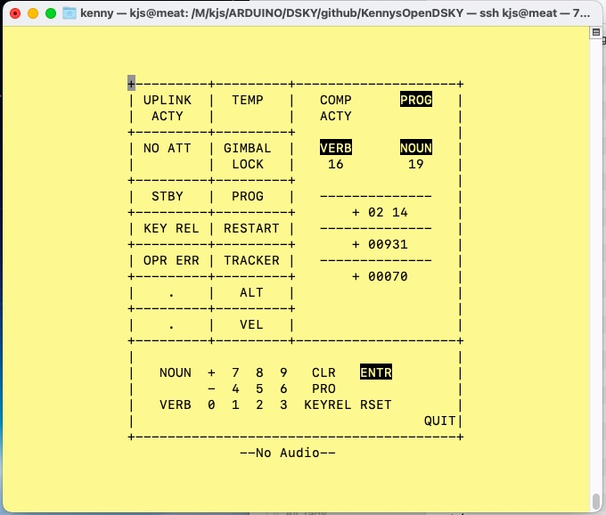

### Keys
The keys map to your keyboard thusly. Only lower case keys are accepted.
+ `0` ... `9` - Digits
+ `+`   - Plus
+ `-`   - Minus
+ `v`   - VERB
+ `n`   - NOUN
+ `p`   - PRO (Proceed)
+ `c`   - CLR (Clear)
+ `k`   - KEY REL (Key Release)
+ `e` or `[return]` - ENTR (Enter)
+ `r`   - RSET (Reset)
+ `q`   - Quit the DSKY simulator

The simulated keyboard at the bottom will **highlight** the most recent key
that was pressed by the user.

The behavior of this program should be identical to the behavior it
will have when run on the Arduino Open DSKY hardware. The GPS and IMU
devices are simulated with *fake* data. The MP3 player only shows audio
as a text line at the bottom of the window. The audio shows how many seconds
remain in the audio clip. But no sound will play! The Real Time clock (RTC)
is simulated but it uses the Linux date and time to initialize itself. The
real time clock can be set by the user to a different date/time in the simulator.

Also emulated is the EEPROM storage and the real time clock 56 byte RAM area.
These values will be stored in the file `persist.txt` so that they will
be remembered between runs of the **curses simulator**.

### Log File
When running the **curses simulator** the file `./log.txt` is produced.
It is used for debugging purposes. Also contains the memory sizes of some data structures.

### Persistent Data
The file `./persist.txt` contains a simulated EEPROM storage and simulated RTC clock RAM.
This allows the **curses simulator** to retain information between runs of the program.
When this file does not exist then these memory areas are initialized to `0xFF`.

## DSKY Usage
This section describes the general usage of the DSKY. The interface was modeled
by my experimentation with a faithful DSKY simulator (See <https://svtsim.com/moonjs/agc.html>).

### General Notes:
+ **ENTR** not required after each verb or noun entry. Pressing **ENTR** causes
    the DSKY to take action on the currently showing verb/noun fields.

+ **KEY REL** - When the **KEY REL** light is blinking, then the KEY REL button can be
    pressed to cancel the entry of a noun/verb.

+ **OPR ERR** - When **OPR ERR** light is blinking then the user should press **RSET** to reset
    this.

+ You *cannot* launch a program using the **PRO** key. Instead you must enter `V37` `ENTR` and
    then type in a two digit program number which appears in the noun field. Then `ENTR` again
    to launch the program.

+ When decimal input is expected, the `+` or `-` sign is required for the first input key.

+ When octal input is expected, neither the `+` or `-` sign is allowed.
	Only the digits `0` - `7` will be accepted.

+ Pressing **RSET** will clear all the caution and warning lights (except KEY REL).

+ The **CLR** key can be pressed while entering values to clear the current entry and start over.

### VERBs, NOUNs, and PROGRAMs
This section documents the available VERB/NOUN combinations and the PROGRAM's.

### Status
**(updated 3/14/2024)**
Not all verb/nouns in the list are implemented yet. This is my list of
what I wish to implement eventually. These items come from the
**Apollo 50th Anniversary** project. I will update this section as
I finish items.

The footnote **[1]** indicates items which have not been implemented yet.

[^1]: Not implemented yet.
[^2]: Temperature in R3 hard coded to **70**.

### Verbs

| VERB | Description                                        |
|------|----------------------------------------------------|
| V01  | test verb incrementing/decrementing values         |
| V02  | test verb. enter R2 in decimal                     |
| V03  | test verb. enter R3 in octal                       |
| V04  | test verb. display some simple values              |
| V05  | clears DSKY, end verb, cleans stack                |
| V06  | Display Selected Value                             |
| V09  | Calculate (Perform Math operation)                 |
| V10  | Convert Radix                                      |
| V16  | Monitor Selected Values                            |
| V21  | Enter value (R1 only)                              |
| V22  | Enter value (R2 only)                              |
| V25  | Enter values (R1 + R2 + R3)                        |
| V26  | Load values from external source[^1]               |
| V35  | LAMP TEST                                          |
| V36  | Fresh Start                                        |
| V37  | Execute Major PROGRAM                              |
| V69  | Force Restart                                      |
| V82  | Monitor Orbital Parameters[^1]                     |

### Nouns
| NOUN | Description                                                       |
|------|-------------------------------------------------------------------|
| N17  | IMU Linear Acceleration values (XXXX, YYYY, ZZZZ)[^1]             |
| N18  | IMU Gyro acceleration values (ROLL, PITCH, YAW)[^1]               |
| N19  | RTC DATE, TIME, IMU TEMP                                          |
| N31  | Time from AGC initialization                                      |
| N32  | Time from Perigee[^1]                                             |
| N34  | Timer count from event (HH, MM, SS.01)[^1]                        |
| N35  | Timer count to Event (HH, MM, SS.01)[^1]                          |
| N36  | RTC Time (HH, MM, SS.01)                                          |
| N37  | RTC Date (YYYY, MM, DD)                                           |
| N38  | GPS Time (HH, MM, SS.01)[^1]                                      |
| N39  | GPS Date (YYYY, MM, SS.01)[^1]                                    |
| N43  | GPS Longitude, Latutude (DD, MM  SS.01)[^1]                       |
| N44  | Orbital Parameters (Apocenter, Pericenter, time to free fall)[^1] |
| N65  | MET (HH, MM, SS.01)[^1]                                           |
| N68  | Lunar Powered Decent[^1]                                          |
| N87  | IMU Accel values with random 1202 errors[^1]                      |
| N98  | Audio Track and Index Adj (TTTTT, NNNNN)                          |

### Verb-Nouns
| VERB-NOUN | Description                                                  |
|-----------|--------------------------------------------------------------|
|V06 N17    | Display IMU linear accel values[^1]                          |
|V06 N18    | Display IMU gyro accel values[^1]                            |
|V06 N19    | Display RTC Date/Time and IMU temp                           |
|V06 N31    | Display time from AGC Init                                   |
|V06 N32    | display time to perigee[^1]                                  |
|V06 N36    | Display RTC time                                             |
|V06 N37    | display RTC date                                             |
|V06 N65    | display met[^1]                                              |
|V06 N38    | Display GPS time[^1]                                         |
|V06 N39    | Display GPS date[^1]                                         |
|           |                                                              |
|V09 N01    | Add stellar zeta angles. R3 = R1+R2                          |
|V09 N02    | Multiply Einstein gravitational cofactors. R3 = R1*R2        |
|V09 N03    | Divide Feynman croc scalars. R3 = R1/R2                      |
|V09 N04    | Remainder R3 = R1 % R2                                       |
|           |                                                              |
|V10 N01    | Decimal to octal conversion. R2 = Octal(R1)                  |
|V10 N02    | Octal to decimal conversion. R2 = Decimal(R1)                |
|           |                                                              |
|V16 N17    | Monitor IMU linear accel values[^1]                          |
|V16 N18    | Monitor IMU Gyro accel values[^1]                            |
|V16 N19    | Monitor RTC Date/Time and IMU temp[^2]                       |
|V16 N31    | Monitor time from agc init                                   |
|V16 N34    | Monitor/Stop Time From event[^1]                             |
|V16 N35    | Monitor/Stop timer count to event[^1]                        |
|V16 N36    | Monitor RTC Time                                             |
|V16 N37    | Monitor RTC Date                                             |
|V16 N38    | Monitor GPS time[^1]                                         |
|V16 N39    | Monitor GPS date[^1]                                         |
|V16 N43    | Monitor GPS coordinates[^1]                                  |
|V16 N44    | Monitor Orbital Parameters[^1]                               |
|V16 N65    | Monitor MET[^1]                                              |
|V16 N68    | A11 Lunar Landing simulation[^1]                             |
|V16 N87    | Monitor IMU linear accel values (with random 1202 alarms)[^1]|
|V16 N98    | Play selected audio clip R1=clip, R2=index adj factor        |
|           |                                                              |
|V21 N98    | Select audio clip number to play                             |
|           |                                                              |
|V22 N98    | Enter index adj. factor                                      |
|           |                                                              |
|V25 N34    | Set/Start timer count from event[^1]                         |
|V25 N35    | Set/Start timer count to event[^1]                           |
|V25 N36    | Set RTC Clock Manually                                       |
|V25 N37    | Set RTC Date Manually                                        |
|           |                                                              |
|V26 N36    | Set RTC Clock from GPS[^1]                                   |
|V26 N37    | Set RTC Date from GPS[^1]                                    |
|           |                                                              |
|V35        | Lamp test                                                    |
|           |                                                              |
|V36        | Fresh Start                                                  |
|           |                                                              |
|V37 N00    | P00 enter idle mode                                          |
|V37 N01    | P01 A11 Launch Simulation[^1]                                |
|V37 N06    | P06 Simulates putting AGC into standby mode                  |
|V37 N11    | P11 Monitor IMU Accel values[^1]                             |
|V37 N42    | "blinky" - randomly illuminate caution and warning lights    |
|V37 N61    | P61 playback JFK i believe                                   |
|V37 N62    | P62 playback JFK We choose                                   |
|V37 N68    | P68 playback A8 Genesis                                      |
|V37 N69    | P69 playback A11 eagle has landed                            |
|V37 N70    | P70 playback A11 we have a problem                           |
|           |                                                              |
|V69        | Force restart                                                |
|           |                                                              |
|V82        | Monitor Orbital parameters[^1]                               |

### Programs
To launch a program type: `V37 ENTR`. The verb and noun fields will
begin blinking. Now enter one of these program numbers.
I.e. To run program P61 you would enter: `VERB 3 7 ENTR 6 1 ENTR`

| PROG | Description                                                        |
|------|--------------------------------------------------------------------|
| P00  | Poo                                                                |
| P01  | Apollo 11 Launch Simulation                                        |
| P06  | Simulate putting AGC into standby mode                             |
| P11  | Display IMU linear acceleration values (same as V16 N18)[^1]       |
| P42  | "blinky" - randomly illuminate caution and warning lights          |
| P61  | play short version of JFK "I believe"                              |
| P62  | play short version of JFK "we choose"                              |
| P68  | play short version of Apollo 8 genesis clip                        |
| P69  | play Apollo 11 the eagle has landed clip                           |
| P70  | play short version of Apollo 13 "problem" clip                     |

## Using the Assembler
The program ``assembler.py`` is a simple one pass assembler written in python.
You will need python3 to recompile the assembly. This github repository
however contains a pre-compiled version of the assembly.

```
  $ assembler.py filename.asm
  Kenny's OpenDSKY Apollo Guidance Computer Assembler
  Little-endian encoding will be used.
  Assembling 'filename.asm'.
  Finished assembling 'filename.asm' -> 'filename.h'.
```

The output is `filename.h`. This file contains the bytecodes in a `Program[]` array.
This is the code that the virtual CPUs will be executing.

If your target architecture is a big endian computer (for example a Solaris or
IBM/AIX unix machine) you will need to switch the byte ordering to big endian.
The default is little endian. To enable big endian byte ordering use the `-b` command
line option. **Little endian** is the appropriate byte ordering to use for
Linux machines and Arduino.

## Assembly Language
This section documents the virtual machine and its machine instructions.

### Virtual Machine Architecture
Here is the CPU architecture of the virtual machine:

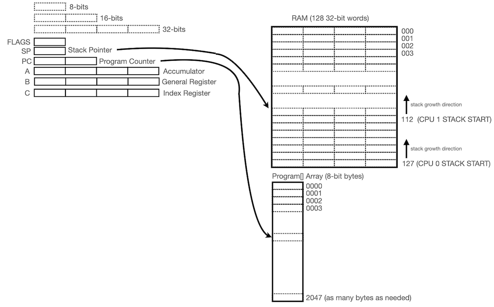

The CPU consists of three 32-bit registers called **A**, **B** and **C**. Different instructions
operate on different registers. The **C** register has special indirect addressing modes
associated with it, so it can be thought of as the "index" register. The **A** register
can be thought of as the "accumulator", although many of the same instructions also
work with the **B** register. These registers are 32-bits wide.

The stack pointer **SP** points into the RAM area. The RAM area consists of 128 memory locations
each capable of storing a 32-bit value.

The program counter **PC** points into the Program[] array which contains the byte codes
that were assembled using the assembler.

The program has access to a bank of RAM locations which are 32-bits wide. There are 128 RAM locations.
This is to hold variables for the assembly programs. It also contains a small stack for each cpu.

The program byte codes are read-only. You can store data tables in this memory area. It
mostly contains the subroutines. VERBs are written in this assembly language. The
starting location for each VERB is stored in a `Verbs[]` dispatch table in `KennyOpenDSKY.cpp`.
Handling of the NOUNs is done by the code for each VERB. Each VERB is responsible for
checking the NOUN field and acting appropriately.

There are two CPU's defined. **cpu 0** is the background thread. **cpu 1** is the foreground thread.
Both threads run concurrently.
The background thread is designed to run major modes (or PROGs). The foreground task runs VERB/NOUN
combinations.

The foreground task can be paused and a new foreground task stacked on top of the currently
running foreground task. For example, If `V16 N36` is running to show the current time.
If the user runs the `V35` (LAMP TEST) verb, then this will pause the current VERB/NOUN and
run the LAMP TEST code. When the LAMP TEST finishes the previous Verb/Noun will be resumed.

The following sections cover the assembly language syntax:

### Comments
Use C++ `//` style comments in the assembly code. I.e.,

```
Loop:
        BRANCH Loop         // loop forever
```

### Labels
Labels are symbols which appear at the beginning of a line and followed by a colon `:`.

```
          CLR_A
          LD_B_IMM8         100
AGAIN:    ADD_A_IMM8        34      // A = A + 34
          DEC_B
          BRANCH_B_GT_IMM8  0  AGAIN
          ENCODE_A_TO_DEC
          MOV_A_R3
```

This code has one label `AGAIN`. It is used as a branch target.
This code adds 34 to the A register one hundred times. Then
the contents of the A register are encoded into Binary Coded Decimal (BCD)
and written to DSKY display field R3.

### Scope Brackets
The curly braces `{` and `}` are scope brackets. They must appear on a line
by themselves. Any labels defined within scoped brackets are removed from
the symbol table after the end scope bracket. This allows reusing symbols
within the body of a function.

```
VERB_34:
{                       // begin scope
Loop:
         GOTO     Loop
}                       // end scope

VERB_35:
{                       // begin scope
Loop:    ADD_A_B
         BRANCH   Loop
}                       // end scope
```

The symbol `Loop` was reused becuse it appears in seperate scope blocks.
The symbols `VERB_34` and `VERB_35` are not inside of scope brackets. These
symbols will be global (and can be referenced in the KennysOpenDSY.cpp file to
add to the Verbs[] dispatch table).

Scope brackets allow for the use of common label names in many places without
having to invent different label names that are unique.

Scope brackets cannot be nested.

### Directives
The assembler supports three directives: `DATA8`, `DATA16` and `DEFINE`.

```
        DEFINE MaxVal = 100
        DEFINE JUNK   = 0x45

        DATA8       0xFF
        DATA8       0x1F
        DATA8       -120
Foo:    DATA8       111
        DATA16      SomeLabel
        DATA16      0x1234
        DATA16      65000
        DATA8       MaxVal
```

The `DATA` directives compile raw data into the Program instruction stream.
This can be used to implement lookup tables. The `DEFINE` directive associates
a value with a symbol. For example instead of using `100` in your assembly code you
can say `MaxVal`. `DATA` directives may be preceeded by a label. I.e., **Foo**.

### Instruction Mnemonic Suffixes

The instruction mnemonics use these suffixes to indicate the addressing modes/arguments:

+ `_IMM8` - Takes an immediate 8-bit value
+ `_IMM16` - Takes an immediate 16-bit value
+ `_IMM32` - Takes an immediate 32-bit value
+ `_DIRECT` - Takes an 8-bit value which represents a RAM memory location
+ `_CINDIRECT` - The C register contains the address to RAM[C] or Program[C].
+ `_U`          - the instruction operates in the unsigned domain
+ `_OCT`        - the instruction operates using Octal radix instead of decimal

### Instruction Arguments
These are the types of arguments instructions can have:

+ `<offset>` - An 8-bit signed value which is added to the program counter when the branch is taken.
+ `<imm8>` - An 8-bit value provided immediately in the Program byte code stream
+ `<imm16>` - A 16-bit value provided immediately in the Program byte code stream
+ `<imm32>` - A 32-bit value provided immediately in the Program byte code stream
+ `<addr>` - An 8-bit unsigned value which refers to a RAM location.
+ `<addr16>` - A 16-bit address to a Program[] location. Used for CALL and GOTO instructions.

In the assembly syntax, arguments are seperated by whitespace. Do not use commas or other
punctuation in the assembly code.

### Numeric Literals
Numeric literals can use signed decimal notation or unsigned hex notation. I.e.,

```
    -4              // decimal literal 8-bits
    1234            // decimal literal 16-bits
    1234999         // decimal literal 32-bits
    0x4E            // hex literal (8-bit)
    0x1f2b          // hex literal (16-bit)
    0x4E001F2F      // 32-bit hex literal
```

The assembler knows the bit size the operands are supposed to be. So
the numeric literal will be converted to the correct width.
Each of the following instructions load A with the number **12**.
But the Program[] array will contain different sized immediate values.

```
     LD_A_IMM32      12       // generates a 32-bit immediate value
     LD_A_IMM16      12       // generates a 16-bit immediate value
     LD_A_IMM8       12       // generates a 8-bit immediate value
```

The most space efficient encoding is the last instruction.

### Instructions

Here are all the assembly instructions:

| Mnemonic          | Arguments  | Description                                                          |
|-------------------|------------|----------------------------------------------------------------------|
| MOV_R1_A          |            | Move the BCD encoded contents of DSKY register R1 into A             |
| MOV_R2_A          |            | Move the BCD encoded contents of DSKY register R2 into A             |
| MOV_R3_A          |            | Move the BCD encoded contents of DSKY register R3 into A             |
| MOV_A_R1          |            | Move the BCD encoded contents of register A into DSKY register R1    |
| MOV_A_R2          |            | Move the BCD encoded contents of register A into DSKY register R2    |
| MOV_A_R3          |            | Move the BCD encoded contents of register A into DSKY register R3    |
| DECODE_A_FROM_OCT |            | Convert BCD encoding of octal value in A into a INT                  |
| DECODE_A_FROM_DEC |            | Convert BCD encoding of decimal into a INT                           |
| ENCODE_A_TO_OCT   |            | Encode A contents as BCD encoded octal                               |
| ENCODE_A_TO_DEC   |            | Encode A contents as BCD encoded decimal (plus/minus sign)           |
| ENCODE_A_TO_UDEC  |            | Encode Positive decimal value (No plus sign) into BCD                |
| MOV_A_B           |            | Move contents of A into B                                            |
| MOV_A_C           |            | Move contents of A into C                                            |
| MOV_B_A           |            | Move contents of B into A                                            |
| MOV_B_C           |            | Move contents of B into C                                            |
| MOV_C_A           |            | Move contents of C into A                                            |
| MOV_C_B           |            | Move contents of C into B                                            |
| LD_A_DIRECT       | addr       | Load into the A register the contents of RAM at addr                 |
| LD_B_DIRECT       | addr       | Load into the B register the contents of RAM at addr                 |
| LD_C_DIRECT       | addr       | Load into the C register the contents of RAM at addr                 |
| LD_A_IMM32        | imm32      | Load into the A register the immediate 32-bit value given by imm32   |
| LD_B_IMM32        | imm32      | Load into the B register the immediate 32-bit value given by imm32   |
| LD_C_IMM32        | imm32      | Load into the C register the immediate 32-bit value given by imm32   |
| LD_A_IMM16        | imm16      | Load into the A register the immediate 16-bit value given by imm16   |
| LD_B_IMM16        | imm16      | Load into the B register the immediate 16-bit value given by imm16   |
| LD_C_IMM16        | imm16      | Load into the C register the immediate 16-bit value given by imm16   |
| LD_A_IMM8         | imm8       | Load into the A register the immediate 8-bit value given by imm8     |
| LD_B_IMM8         | imm8       | Load into the B register the immediate 8-bit value given by imm8     |
| LD_C_IMM8         | imm8       | Load into the C register the immediate 8-bit value given by imm8     |
| LD_A_CINDIRECT    |            | Load A register with contents of RAM at address given by C           |
| LD_B_CINDIRECT    |            | Load B register with contents of RAM at address given by C           |
| ST_A_DIRECT       | addr       | Store A register to the RAM location given by addr                   |
| ST_B_DIRECT       | addr       | Store B register to the RAM location given by addr                   |
| ST_C_DIRECT       | addr       | Store C register to the RAM location given by addr                   |
| ST_A_CINDIRECT    |            | Store A register to the RAM location given by C                      |
| ST_B_CINDIRECT    |            | Store B register to the RAM location given by C                      |
| CLR_A             |            | Clear the A register to a value of 0                                 |
| CLR_B             |            | Clear the B register to a value of 0                                 |
| CLR_C             |            | Clear the C register to a value of 0                                 |
| INC_A             |            | Increment the A register by 1                                        |
| INC_B             |            | Increment the B register by 1                                        |
| INC_C             |            | Increment the C register by 1                                        |
| DEC_A             |            | Decrement the A register by 1                                        |
| DEC_B             |            | Decrement the B register by 1                                        |
| DEC_C             |            | Decrement the C register by 1                                        |
| PUSH_A            |            | Store the A register in RAM at address given by SP. Decrement SP     |
| PUSH_B            |            | Store the B register in RAM at address given by SP. Decrement SP     |
| PUSH_C            |            | Store the C register in RAM at address given by SP. Decrement SP     |
| POP_A             |            | Increment SP. Load the A register from RAM address given by SP       |
| POP_B             |            | Increment SP. Load the B register from RAM address given by SP       |
| POP_C             |            | Increment SP. Load the C register from RAM address given by SP       |
| CALL              | addr16     | Call subroutine at addr16. Push PC+3 on the stack                    |
| RET               |            | Pop program counter from the stack                                   |
| GOTO              | addr16     | Store addr16 into the program counter PC                             |
| BRANCH            | offset     | Add signed 8-bit value to program counter                            |
| BRANCH_A_GT_B     | offset     | If A >  B then add the branch offset to PC. Else next instruction    |
| BRANCH_A_GE_B     | offset     | If A >= B then add the branch offset to PC. Else next instruction    |
| BRANCH_A_LE_B     | offset     | If A <= B then add the branch offset to PC. Else next instruction    |
| BRANCH_A_LT_B     | offset     | If A < B then add the branch offset to PC. Else next instruction     |
| BRANCH_A_EQ_B     | offset     | If A == B then add the branch offset to PC. Else next instruction    |
| BRANCH_A_NE_B     | offset     | If A != B then add the branch offset to PC. Else next instruction    |
| BRANCH_A_GT_DIRECT | addr offset | If A >  RAM[addr] then add offset to PC. Else next instr.          |
| BRANCH_A_GE_DIRECT | addr offset | If A >= RAM[addr] then add offset to PC. Else next instr.          |
| BRANCH_A_LE_DIRECT | addr offset | If A <= RAM[addr] then add offset to PC. Else next instr.          |
| BRANCH_A_LT_DIRECT | addr offset | If A < RAM[addr] then add offset to PC. Else next instr.           |
| BRANCH_A_EQ_DIRECT | addr offset | If A == RAM[addr] then add offset to PC. Else next instr.          |
| BRANCH_A_NE_DIRECT | addr offset | If A != RAM[addr] then add offset to PC. Else next instr.          |
| BRANCH_A_GT_IMM8   | imm8 offset | If A >  imm8 then add offset to PC. Else next instr.               |
| BRANCH_A_GE_IMM8   | imm8 offset | If A >= imm8 then add offset to PC. Else next instr.               |
| BRANCH_A_LE_IMM8   | imm8 offset | If A <= imm8 then add offset to PC. Else next instr.               |
| BRANCH_A_LT_IMM8   | imm8 offset | If A < imm8 then add offset to PC. Else next instr.                |
| BRANCH_A_EQ_IMM8   | imm8 offset | If A == imm8 then add offset to PC. Else next instr.               |
| BRANCH_A_NE_IMM8   | imm8 offset | If A != imm8 then add offset to PC. Else next instr.               |
| BRANCH_A_GT_IMM16  | imm16 offset | If A >  imm16 then add offset to PC. Else next instr.             |
| BRANCH_A_GE_IMM16  | imm16 offset | If A >= imm16 then add offset to PC. Else next instr.             |
| BRANCH_A_LE_IMM16  | imm16 offset | If A <= imm16 then add offset to PC. Else next instr.             |
| BRANCH_A_LT_IMM16  | imm16 offset | If A < imm16 then add offset to PC. Else next instr.              |
| BRANCH_A_EQ_IMM16  | imm16 offset | If A == imm16 then add offset to PC. Else next instr.             |
| BRANCH_A_NE_IMM16  | imm16 offset | If A != imm16 then add offset to PC. Else next instr.             |
| BRANCH_B_GT_DIRECT | addr offset | If B > RAM[addr] then add offset to PC. Else next instr.           |
| BRANCH_B_GE_DIRECT | addr offset | If B >= RAM[addr] then add offset to PC. Else next instr.          |
| BRANCH_B_LE_DIRECT | addr offset | If B <= RAM[addr] then add offset to PC. Else next instr.          |
| BRANCH_B_LT_DIRECT | addr offset | If B < RAM[addr] then add offset to PC. Else next instr.           |
| BRANCH_B_EQ_DIRECT | addr offset | If B == RAM[addr] then add offset to PC. Else next instr.          |
| BRANCH_B_NE_DIRECT | addr offset | If B != RAM[addr] then add offset to PC. Else next instr.          |
| BRANCH_B_GT_IMM8   | imm8 offset | If B > imm8 then add offset to PC. Else next instr.                |
| BRANCH_B_GE_IMM8   | imm8 offset | If B >= imm8 then add offset to PC. Else next instr.               |
| BRANCH_B_LE_IMM8   | imm8 offset | If B <= imm8 then add offset to PC. Else next instr.               |
| BRANCH_B_LT_IMM8   | imm8 offset | If B < imm8 then add offset to PC. Else next instr.                |
| BRANCH_B_EQ_IMM8   | imm8 offset | If B == imm8 then add offset to PC. Else next instr.               |
| BRANCH_B_NE_IMM8   | imm8 offset | If B != imm8 then add offset to PC. Else next instr.               |
| BRANCH_B_GT_IMM16  | imm16 offset | If B > imm16 then add offset to PC. Else next instr.              |
| BRANCH_B_GE_IMM16  | imm16 offset | If B >= imm16 then add offset to PC. Else next instr.             |
| BRANCH_B_LE_IMM16  | imm16 offset | If B <= imm16 then add offset to PC. Else next instr.             |
| BRANCH_B_LT_IMM16  | imm16 offset | If B < imm16 then add offset to PC. Else next instr.              |
| BRANCH_B_EQ_IMM16  | imm16 offset | If B == imm16 then add offset to PC. Else next instr.             |
| BRANCH_B_NE_IMM16  | imm16 offset | If B != imm16 then add offset to PC. Else next instr.             |
| BRANCH_NOT_TIMER1  | offset    | branch if timer1 (100ms) hasn't triggered, else next instruction     |
| BRANCH_NOT_TIMER2  | offset    | branch if timer2 (200ms) hasn't triggered, else next instruction     |
| BRANCH_NOT_TIMER3  | offset    | branch if timer3 (300ms) hasn't triggered, else next instruction     |
| BRANCH_NOT_TIMER4  | offset    | branch if timer4 (1s) hasn't triggered, else next instruction        |
| BRANCH_NOT_TIMER5  | offset    | branch if timer5 (2s) hasn't triggered, else next instruction        |
| SWAP_A_B           |           | Swap registers A and B                                               |
| SWAP_A_C           |           | Swap registers A and C                                               |
| SWAP_B_C           |           | Swap registers B and C                                               |
| ADD_A_B            |           | A = A + B                                                            |
| ADD_B_A            |           | B = B + A                                                            |
| SUB_A_B            |           | A = A - B                                                            |
| SUB_B_A            |           | B = B - A                                                            |
| MUL_A_B            |           | A = A * B                                                            |
| MUL_B_A            |           | B = B * A                                                            |
| DIV_A_B            |           | A = A / B                                                            |
| DIV_B_A            |           | B = B / A                                                            |
| MOD_A_B            |           | A = A % B                                                            |
| MOD_B_A            |           | B = B % A                                                            |
| AND_A_B            |           | A = A & B                                                            |
| AND_B_A            |           | B = B & A                                                            |
| OR_A_B             |           | A = A \| B                                                           |
| OR_B_A             |           | B = B \| A                                                           |
| OR_A_IMM32         | imm32     | A = A \| imm32                                                       |
| OR_B_IMM32         | imm32     | B = B \| imm32                                                       |
| AND_A_IMM32        | imm32     | A = A & imm32                                                        |
| AND_B_IMM32        | imm32     | B = B & imm32                                                        |
| LSHIFT_A_IMM8      | imm8      | A = A << imm8                                                        |
| LSHIFT_B_IMM8      | imm8      | B = B << imm8                                                        |
| RSHIFT_A_IMM8      | imm8      | A = A >> imm8                                                        |
| RSHIFT_B_IMM8      | imm8      | B = B >> imm8                                                        |
| NOT_A              |           | A = ~A                                                               |
| NOT_B              |           | B = ~B                                                               |
| NEG_A              |           | A = -A                                                               |
| NEG_B              |           | B = -B                                                               |
| MOV_A_VERB         |   | Move LSB byte of register A into VERB DSKY field (assumed to be BCD encoded) |
| MOV_A_NOUN         |   | Move LSB byte of register A into NOUN DSKY field (assumed to be BCD encoded) |
| MOV_A_PROG         |   | Move LSB byte of register A into PROG DSKY field (assumed to be BCD encoded) |
| MOV_NOUN_A         |   | Move NOUN DSKY field into LSB byte of register A                             |
| MOV_VERB_A         |   | Move VERB DSKY field into LSB byte of register A                             |
| MOV_PROG_A         |   | Move PROG DSKY field into LSB byte of register A                             |
| BLINK_VERB         | imm8      | 1 or 0. enable/disable blinking of VERB digits                       |
| BLINK_NOUN         | imm8      | 1 or 0. enable/disable blinking of NOUN digits                       |
| BLINK_PROG         | imm8      | 1 or 0. enable/disable blinking of PROG digits                       |
| BLINK_KEYREL       | imm8      | 1 or 0. enable/disable blinking of KEYREL status light               |
| BLINK_OPRERR       | imm8      | 1 or 0. enable/disable blinking of OPR ERR status light              |
| BLINK_R1           | imm8      | 1 or 0. enable/disable blinking of DSKY R1 digits                    |
| BLINK_R2           | imm8      | 1 or 0. enable/disable blinking of DSKY R2 digits                    |
| BLINK_R3           | imm8      | 1 or 0. enable/disable blinking of DSKY R3 digits                    |
| LT_UPLINK_ACTY     | imm8      | 1 or 0. turn on/turn off the UPLINK ACTY status light                |
| LT_NO_ATT          | imm8      | 1 or 0. turn on/turn off the NO ATT status light                     |
| LT_STBY            | imm8      | 1 or 0. turn on/turn off the STBY status light                       |
| LT_OPR_ERR         | imm8      | 1 or 0. turn on/turn off the OPR ERR status light                    |
| LT_KEY_REL         | imm8      | 1 or 0. turn on/turn off the KEY REL status light                    |
| LT_NA1             | imm8      | 1 or 0. turn on/turn off the NA1 status light                        |
| LT_NA2             | imm8      | 1 or 0. turn on/turn off the NA2 status light                        |
| LT_TEMP            | imm8      | 1 or 0. turn on/turn off the TEMP status light                       |
| LT_GIMBAL_LOCK     | imm8      | 1 or 0. turn on/turn off the GIMBAL LOCK status light                |
| LT_PROG_ALRM       | imm8      | 1 or 0. turn on/turn off the PROG ALRM status light                  |
| LT_RESTART         | imm8      | 1 or 0. turn on/turn off the RESTART status light                    |
| LT_TRACKER         | imm8      | 1 or 0. turn on/turn off the TRACKER status light                    |
| LT_ALT             | imm8      | 1 or 0. turn on/turn off the ALT status light                        |
| LT_VEL             | imm8      | 1 or 0. turn on/turn off the VEL status light                        |
| LT_COMP_ACTY       | imm8      | 1 or 0. turn on/turn off the COMP ACTY light                         |
| LT_VERB            | imm8      | 1 or 0. turn on/turn off the VERB light                              |
| LT_NOUN            | imm8      | 1 or 0. turn on/turn off the NOUN light                              |
| LT_PROG            | imm8      | 1 or 0. turn on/turn off the PROG light                              |
| LT_ALL             | imm8      | 1 or 0. turn on/turn off ALL status lights                           |
| UPLINK_PROB_IMM8   | imm8 | set UPLINK ACTY random blink probability to imm8 0=off, 255=always on     |
| COMPACTY_PROB_IMM8 | imm8 | set COMP ACTY random blink probability to imm8 0=off, 255=always on       |
| GPS_LAT_A          |           | Read GPS unit and place Latitude into A                              |
| GPS_LON_A          |           | Read GPS unit and place Longtitude into A                            |
| GPS_YEAR_A         |           | Read GPS unit and place Year into A                                  |
| GPS_MON_A          |           | Read GPS unit and place Month into A                                 |
| GPS_DAY_A          |           | Read GPS unit and place Day into A                                   |
| GPS_HH_A           |           | Read GPS unit and place Hours into A                                 |
| GPS_MM_A           |           | Read GPS unit and place Minutes into A                               |
| GPS_SS_A           |           | Read GPS unit and place Seconds into A                               |
| BRANCH_TIMESTAMP_LT| addr1 addr2 offset | branch if timestamp1 less than timestamp2                   |
| TIMESTAMP_DIFF_A   | addr1 addr2 | diff timestamp1 in addr1 and timestamp2 in addr2 put result into A |
| RTC_TIMESTAMP_DIRECT | addr    | store entire RTC timestamp to addr+0 and addr+1                      |
| RTC_DAY_A          |           | Read RTC and place DAY field into A register  (BCD encoded)          |
| RTC_YEAR_A         |           | Read RTC and place YEAR field into A register (BCD encoded)          |
| RTC_MON_A          |           | Read RTC and place MONTH field into A register (BCD encoded)         |
| RTC_HH_A           |           | Read RTC and place HOURS field into A register (BCD encoded)         |
| RTC_MM_A           |           | Read RTC and place MINUTES field into A register (BCD encoded)       |
| RTC_SS_A           |           | Read RTC and place SECONDS field into A register (BCD encoded)       |
| RTC_MEM_A_CINDIRECT|           | Read RTC RAM address [C] and place into A register                   |
| RTC_A_MEM_CINDIRECT|           | Write LSB of A register into RTC RAM address [C]                     |
| IMU_ACCX_A         |           | Move IMU Acceleration X value into A                                 |
| IMU_ACCY_A         |           | Move IMU Acceleration Y value into A                                 |
| IMU_ACCZ_A         |           | Move IMU Acceleration Z value into A                                 |
| IMU_PITCH_A        |           | Move IMU Pitch value into A                                          |
| IMU_ROLL_A         |           | Move IMU Roll value into A                                           |
| IMU_YAW_A          |           | Move IMU Yaw value into A                                            |
| IMU_TEMP_A         |           | Move IMU Temp value into A                                           |
| MP3_PLAY_A         |           | play track number indicated by register A                            |
| MP3_STOP           |           | stop playing any track. (play the silence clip)                      |
| EEPROM_WRITE_A_CINDIRECT |     | write A register byte to EEPROM[C]                                   |
| EEPROM_READ_A_CINDIRECT  |     | read into A register byte from EEPROM[C]                             |
| WAIT1              |           | pause CPU until 100ms timer triggers, then proceed to next instr.    |
| WAIT2              |           | pause CPU until 200ms timer triggers, then proceed to next instr.    |
| WAIT3              |           | pause CPU until 300ms timer triggers, then proceed to next instr.    |
| WAIT4              |           | pause CPU until 1s timer triggers, then proceed to next instr.       |
| WAIT5              |           | pause CPU until 2s timer triggers, then proceed to next instr.       |
| INPUT_NOUN         |  | Read a NOUN from the keyboard. A=value means good. A=-1 means bad             |
| INPUT_R1           |  | Read a signed decimal number into R1. A=value good. A=-1 Bad                  |
| INPUT_R2           |  | Read a signed decimal number into R2. A=value good. A=-1 Bad                  |
| INPUT_R3           |  | Read a signed decimal number into R3. A=value good. A=-1 Bad                  |
| INPUT_R1_OCT       |  | Read an octal value into R1. A=value good. A=-1 Bad                           |
| INPUT_R2_OCT       |  | Read an octal value into R2. A=value good. A=-1 Bad                           |
| INPUT_R3_OCT       |  | Read an octal value into R3. A=value good. A=-1 Bad                           |
| INPUT_PROCEED      |  | Wait for PRO key (Proceed) to be pressed. A=0 PRO pressed. A=-1 Cancelled     |
| INPUT_REQ_PROCEED  |  | Wait for PRO key (Proceed) to be pressed. A=0 PRO pressed.                    |
| PROG8_A_CINDIRECT  |           | A = Program[C] read byte from program memory                         |
| PROG16_A_CINDIRECT |           | A = Program[C] read 16-bit word from program memory C, C+1           |
| PROG32_A_CINDIRECT |           | A = Program[C] read 32-bit word from program memory C, C+1, C+2, C+3 |
| ADD_A_IMM8         | imm8      | Add signed byte imm8 to A register                                   |
| ADD_B_IMM8         | imm8      | Add signed byte imm8 to B register                                   |
| ADD_C_IMM8         | imm8      | Add signed byte imm8 to C register                                   |
| EMPTY_STACK        |           | Reset the stack to be empty for the CPU core                         |
| RUN_PROG_A         | | cause cpu core 0 to run program located at 16-bit address in A. Reset stack    |
| RUN_MINOR_A        | | cause cpu core 1 to run program located at 16-bit address in A. Reset stack    |
| CALL_CINDIRECT     |           | call a subroutine whose address is in the C register                 |
| PUSH_DSKY          |           | push DSKY state on stack                                             |
| POP_DSKY           |           | pop DSKY state on stack                                              |
| RANDOM_A           |           | Populate A register with a random 16-bit value                       |

### Example
This is an example of what the assembly code looks like.
This is `VERB_37` from the assembly file.

```
//
// Run major mode
//
VERB_37:
{
            LD_A_IMM8       0xAA
            MOV_A_NOUN          // clear noun field
            BLINK_VERB  1
            BLINK_NOUN  1

            INPUT_NOUN
            LD_B_IMM16  0x00FF
            AND_A_B
            MOV_A_B
            BRANCH_B_LT_IMM8    0   Error

            LD_C_IMM16  Programs

Next:       PROG8_A_CINDIRECTC
            BRANCH_A_EQ_IMM8    -1      NotFound
            INC_C
            ST_A_DIRECT         PROG_TMP1
            PROG16_A_CINDIRECT
            ADD_C_IMM8          2
            BRANCH_B_EQ_DIRECT  PROG_TMP1   Found
            BRANCH  Next

Programs:   DATA8       0x00
            DATA16      PROG_00
            DATA8       0x01
            DATA16      PROG_01
            DATA8       0x02
            DATA16      PROG_02
            DATA8       0x60
            DATA16      PROG_60
            DATA8       0x61
            DATA16      PROG_61
            DATA8       0x62
            DATA16      PROG_62
            DATA8       0x68
            DATA16      PROG_68
            DATA8       0x69
            DATA16      PROG_69
            DATA8       0x70
            DATA16      PROG_70
            DATA8       -1

Found:
            SWAP_A_B
            // ENCODE_A_TO_DEC
            MOV_A_PROG
            SWAP_A_B
            RUN_PROG_A
            BRANCH Done

NotFound:
Error:
            BLINK_OPRERR    1

Done:
            BLINK_VERB  0
            BLINK_NOUN  0
            RET
}
```

## Code Walk Through
The main function is called `apollo_guidance_computer()`.
The main data structure that is manipulated is the variable `Agc`.

The `Agc` variable contains the DSKY state (both current and previous). It
also contains the two CPU cores and the RAM area. Plus some additional flags.

```
static APOLLO_GUIDANCE_COMPUTER Agc;
```

This is the main routine for the whole thing:

```
void apollo_guidance_computer()
{
    agc_init();

    for(;;)
    {
        agc_execute_cpu(0);     // background thread
        agc_execute_cpu(1);     // foreground thread

        ch = readKeyboard();
        input = MAP_INPUT(ch);

        new_state = StateMachine[Agc.state][input];
        Agc.state = new_state;
        switch(Agc.state) {
        case S_ST:
            ...
        }

        // timer 1 action - blinking behavior and 'COMP ACTY' and 'UPLINK ACTY' flicker.
        // timer 2 action NOT USED
        // timer 3 action NOT USED
        // timer 4 action NOT USED
        // timer 5 action NOT USED

        dsky_redraw(&Agc.dsky, &Agc.prev);
    }
}
```

This function performs these steps:
1. The `Agc` is initialized by the call to `agc_init()`.
2. A forever loop that is the main event-display loop
3. Execute the two CPU cores for one instruction.
   `agc_execute_cpu()` runs the CPU core for one instruction.
4. Check the keyboard. If a keyboard character has been recieved then
    apply the new input to the state machine. `Agc.state` is the current state
    the DSKY is in.
5. Check the timer bits to see if the 100ms timer has triggered. If it has then:
    + Handle blinking behavior for various DSKY elements that can be set to blink.
    + Handle the flickering of the COMP ACTY and UPLINK ACTY lights.
6. Redraw the DSKY state.

### Display Refresh
The way the display is redrawn is via the function `dsky_redraw()`.
Two copies of the DSKY display state are stored. `Agc.prev` contains
the DSKY display state most recently drawn. `Agc.dsky` contains the
new DSKY display state that we wish to display.

`dsky_redraw()` compares the old and new state. If nothing has changed
then nothing needs to be redrawn. Otherwise a series of `if` statements
are executed to see what parts of the DSKY has changed.

The last step of `dsky_redraw()` is to assign the current DSKY state to
the previous DSKY state.

### Add New Instructions
To add a new instruction to the virtual machine:

1. Add your new instruction to `enum AGC_INSTRUCTION` in `KennysOpenDSKY.cpp`.
2. Add your new instruction to the debug string array `Mnemonics[]`.
3. Add your new instruction to the associative array `InstructionTable` in `assembler.py`.
4. Add a new case to the switch statement in the routine, `agc_execute_cpu()`.
5. And of course update the `README.md` file.

### Adding a new VERB
There is an array called `Verbs[]` (in `KennysOpenDSKY.cpp`) which contains all the
verbs that can be entered.

```
static const DISPATCH_ENTRY Verbs[] PROGMEM = {
    { 0x35, LBL_VERB_35 },
    { 0x01, LBL_VERB_01 },
    { 0x37, LBL_VERB_37 },
    { 0x02, LBL_VERB_02 },
    { 0x03, LBL_VERB_03 },
    { 0x04, LBL_VERB_04 },
    { 0x05, LBL_VERB_05 },
    { 0x16, LBL_VERB_16 },
    { 0x36, LBL_VERB_36 },
    { 0x69, LBL_VERB_69 },
};
```

To add a new verb, add a new entry to this table. The identifier `LBL_VERB_03` is created
from the assembly files: `kennysagc.asm` and `kennysagc.h`. In this table you provide
the BCD encoded verb number and the starting location for the VERB code.

Nouns and Programs are not stored in any dispatch table. These features are all handled
by the assembly code. Each VERB must handle the set of NOUNs it knows about.

Programs are launched by using the **VERB 37** verb.

### Adding a new PROGRAM
To add a new program edit, `kennysagc.asm` and modify the subroutine `VERB_37`.
In there is a table of program labeled `Programs` which you can extend.
Now write your code as a seperate subroutine. This program can now be invoked
by entering the correct `V37 Nxx` command.

Programs run in **cpu core 0** concurrently with whatever is running in **cpu core 1**.
**cpu core 1** runs the user entered VERBs/NOUNs. This allows for the running of two seperate
"jobs"; one in **cpu 0** and another one in **cpu 1**.

## Green Acrylic Modification
This section describes my modification to the Open DSKY. I decided
I didn't like how fuzzy the LED digits were. I decided to use a green
acrylic window to make the LED region nicer to look at and avoid
the fuzzyness and dimness of the original kit.

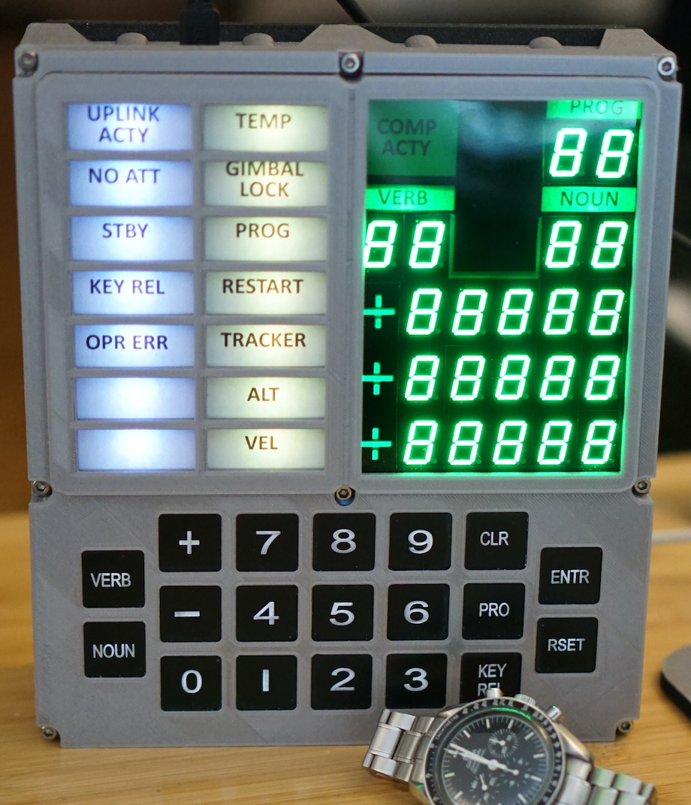

I bought this product from amazon.com:
```
    Transparent Green Acrylic Sheet (12" x 20", 1/16" / 1.5mm)
    (MakerStock Store)
```
Make sure the thickness is 1.5mm.

I measured the desired size and used a utility knife to cut the plastic.
I used a metal ruler to maintain a straight line.

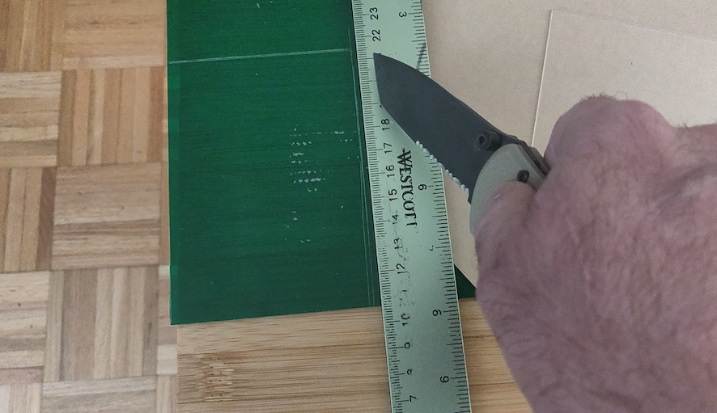

After 10 to 12 cuts I broke
the plastic along the straight edge of a table. The plastic broke cleanly along the
line I had scored with the knife.
I fine tuned the size of the piece by shaving off plastic from the sides using the knife.

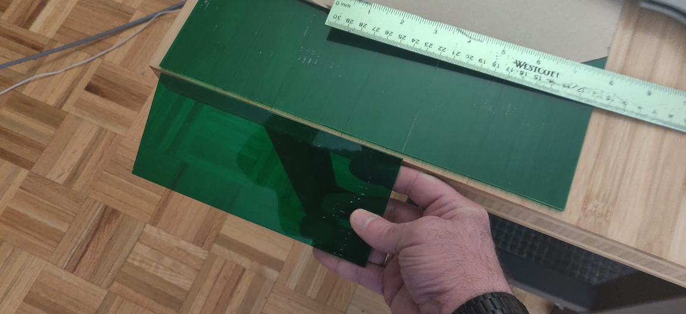

I did the same cutting operation to the provided clear plastic that came
with the Open DSKY kit.

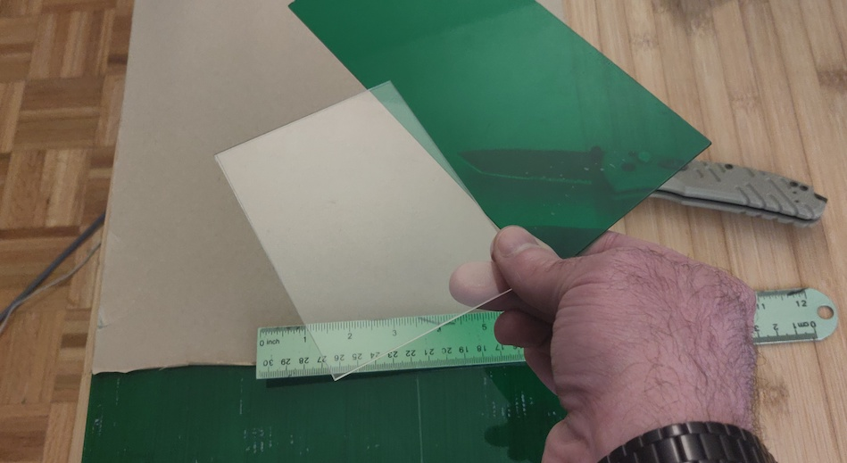

NOTE: I used duct tape to adhere my green acrylic sheet to the table I was working on
as well as the ruler so that it wouldn't move.

I cut in half the sticker that came with the Open DSKY kit. I retained the left hand side
of the sticker for the caution and warning lights pane. But I threw away the right hand side.

Using my laser printer I printed out [`screen_stuff.pdf`](images/screen_stuff.pdf).

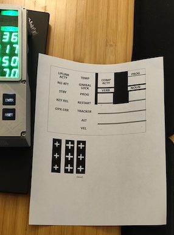

Then I used scissors to cut out a the black region plus VERB/NOUN/PROG text.
I also cut out the block of **plus** symbols.

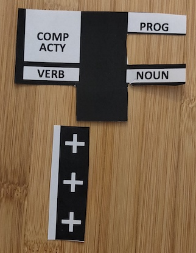

This I carefully positioned over the VERB/NOUN/PROG lights. I also
overlayed the block of **plus** symbols over the **plus** 7-segment LEDs.

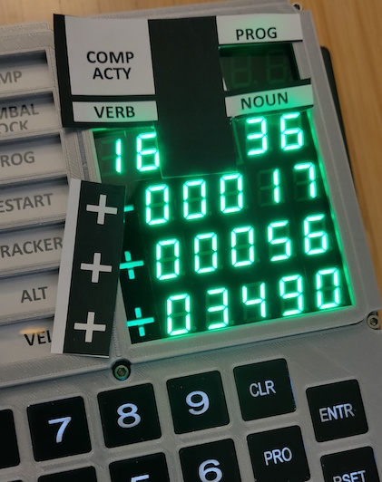

I used a small piece of scotch tape to hold these overlays in place while I assembled the
display and bezel. Best results are achieved if the black ink covers anything inside that
might reflect light.

## Review of the Open DSKY Kit
This section contains my thoughts on the Open DSKY kit.
The specific product I ordered was the **DSKY Slim Kit**.

Overall I loved it. It requires a lot of detail work for final assembly.
However, this is a kit and as one of the creators says in a YouTube video:
"A big part of the DIY is the **Y**. Do it yourself, not do it for me."
<https://www.youtube.com/watch?v=xPJfywL251g&t=2251s> *[at 7 minutes 30 seconds]*

Final assembly required me to use a dremel grinding tool to carve out plastic
from the back in order to ensure the front cover fits snuggly onto the cicruit board.

I didn't like the "sticker" which you use to cover over the beautiful 7-segment LED's, so I
customized my device (see the section [Green Acrylic Modification](#green-acrylic-modification)).

The electronics and provided circuit board were excellent. All the parts were well labeled.
This kit makes for a great platform to play with the Arduino and program different devices:
GPS, IMU, MP3 player and Real Time Clock.

Little details included with the Kit were also very nice. There were two stickers that you
affix to the case which look like official NASA tracking signage. There was also a tiny
little 3d-printed DSKY.

### Sticker 1
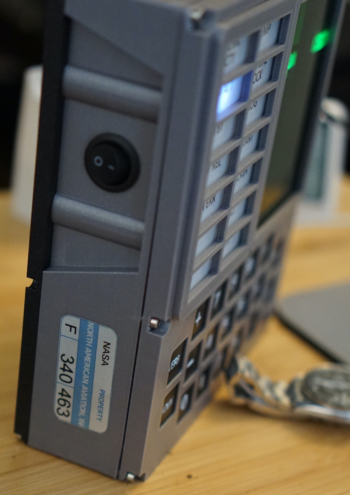

### Sticker 2
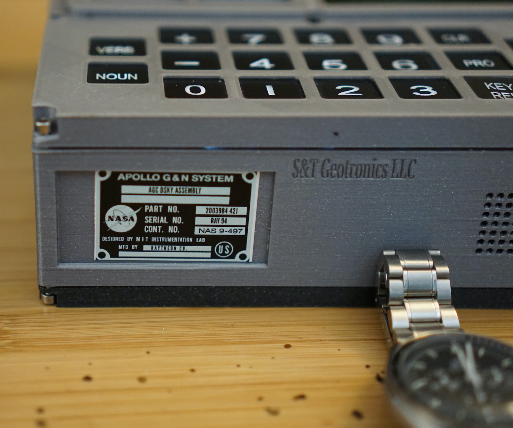

### Mini-DSKY
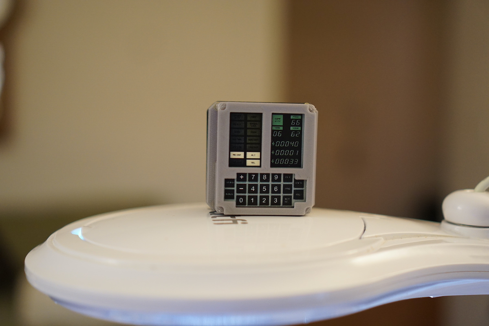

The assembly instructions were a little sparse. But this increased my feeling of satisfaction
when I successfully built the thing. How to perform final assembly was not well documented.
Having said that, the [instructables](https://www.instructables.com/Open-Apollo-Guidance-Computer-DSKY)
website was pretty good with lots of pictures of each step.
The instructions became sparse when the assembly of the case was concerned. The kit offered
several logical points to test the device before final soldering of all components. For example
you could test the lamps early on. Then the button lights, then the 7-segment LEDs.

Be careful with the buttons. Using wire cutters to cut off the plastic bump on all the buttons
can result in inadvertently cutting the wire lead that illuminates the button. Thankfully
they provide an extra button if you screw one of them up.

Make sure the GPS unit is flush with the circuit board when you solder it on.

All the components came in indiviual plastic and were labeled. There was a inventory sheet
showing all the components. The kit arrived in good packaging. I definately felt the kit was worth the $600.

There are good online schematics. The sample source code is pretty gross, but also pretty easy
to reverse engineer. Unfortunately, there lacks a schematic showing how the MP3 player was wired up.

In summary, I am very happy with the kit and feel I got my money's worth. I am an Apollo
space nut, so a DSKY was always something I wanted. I am pleased that my **Kenny's
Open DSKY software** will give me a way to experiment with this kit and build cool apps for it.
It was fun trying to write software for a such a constrained system
(The arduino Nano only has 30KB of program memory and 2KB of RAM; and it is an 8-bit CPU).

## Author
Ken Stauffer<BR>
New York, NY.<BR>
2/14/2024

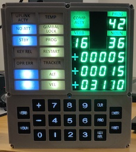
